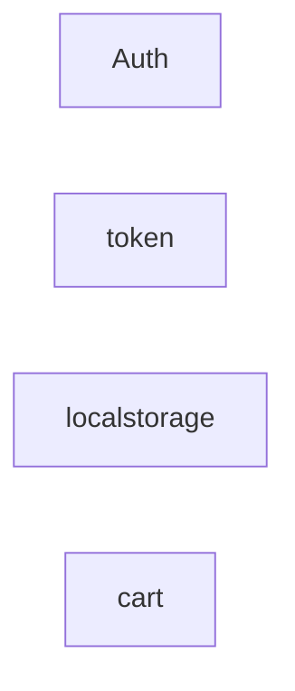
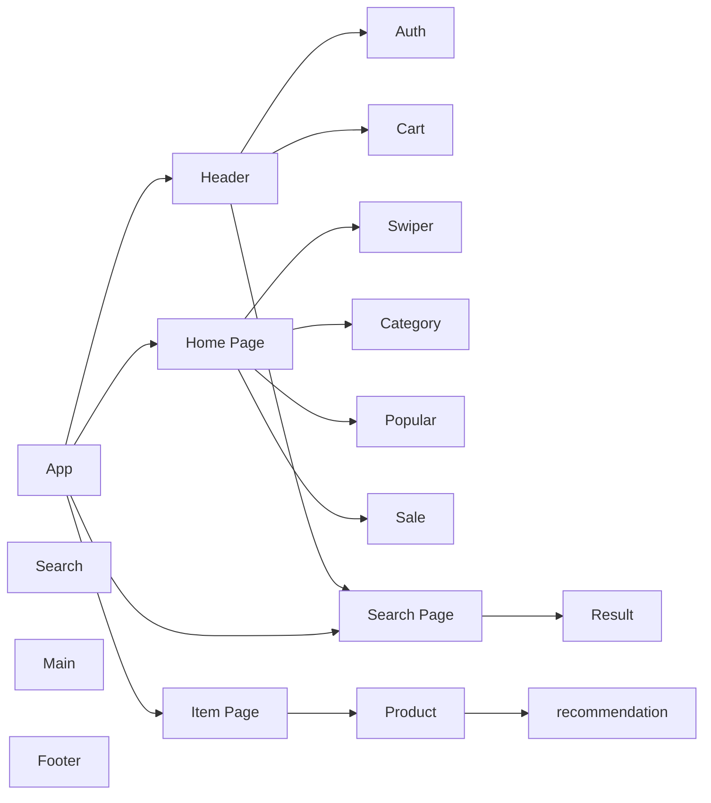
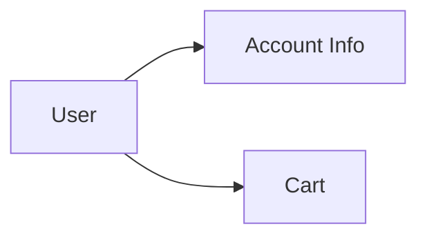

# E-commerce Template

> E-commerce website build with React.

## Build with

- React
- Fake Store API (https://fakestoreapi.com/)
- Tailwind
- Vitest

## Usage

## Installation

```bash
git clone https://github.com/MattisZheng/e-commerce.git
npm install
```

## Doc

### Logic flow



### UI flow



### Data flow



## Contribute guide

## License

## Dev log

v0.0.0

- [x] v0.01 Layout
- [x] v0.02 Nav
- [x] v0.03 API
- [x] v0.04 Product page
- [x] v0.05 Home page
- [x] v0.06 Search bar
  - [x] Recommendation
  - [x] Categories
- [x] v0.07 Search result page
  - [x] Sort
    - [x] Price
    - [x] Popularity
    - [x] Rating
- [x] v0.08 Routing
- [x] v0.09 Auth
- [x] v0.10 Cart
- [x] v0.12 Unit Testing

v1.0.0 Main Site

- [x] v1.01 Web
- [x] v1.02 RWD
  - [ ] Header
  - [ ] Footer
  - [ ] Nav
  - [ ] Main
- [ ] v1.03 PWA

v2.0.0 Cross-platform

- [ ] v2.01 searching methods
  - [ ] history
  - [ ] autocomplete
  - [ ] keyword
    - [ ] category
    - [ ] title
    - [ ] filter
- [ ] v2.02 lazy load
- [ ] v2.03 cart
  - [ ] modal
  - [ ] search
- [ ] debounce & throttle

v3.0.0 User Experience
