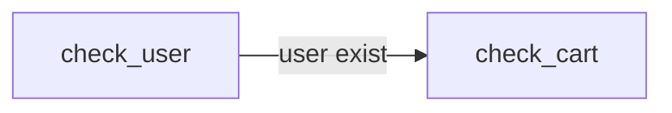
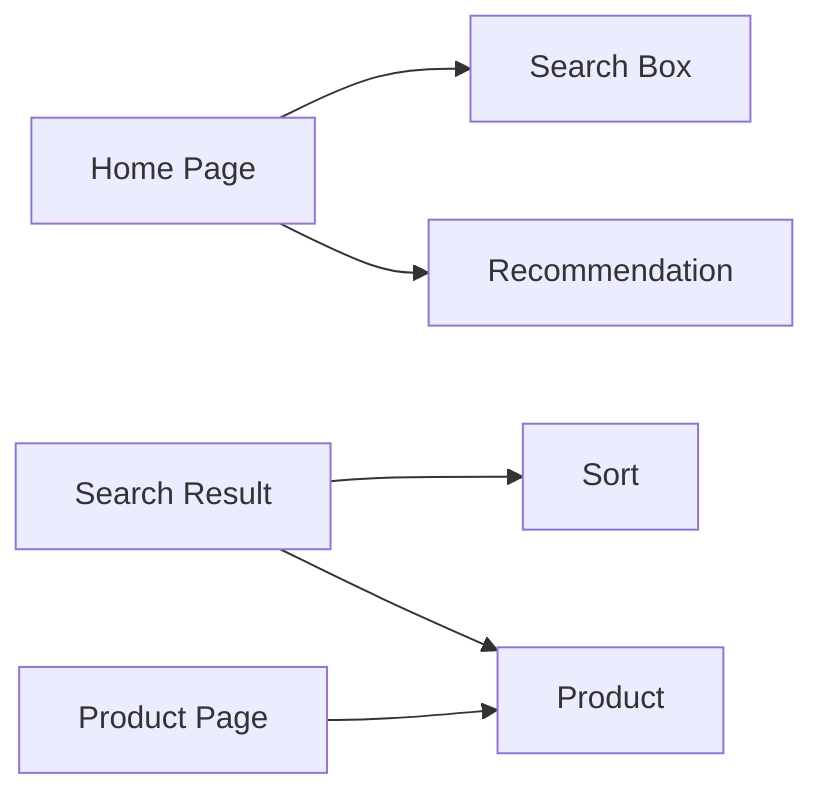
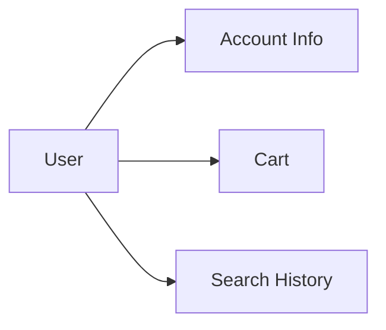

# E-commerce Template

> E-commerce website build with React.

## Build with

- React
- Stripe.js
- Axios
- Tailwind
- Testing Library

## Usage

## Installation

```bash
git clone https://github.com/MattisZheng/e-commerce.git
npm install
```

## Doc

### Logic flow



### UI flow



home --> search & recommendation

### Data flow



## Contribute guide

## License

## Dev log

v0.0.0

- [x] v0.01 Layout
- [x] v0.02 Nav
- [x] v0.03 API
- [x] v0.04 Product page
  - [x] Images
  - [x] Description
- [x] v0.05 Home page
- [x] v0.06 Search bar
  - [x] Recommendation
  - [x] Categories
- [ ] v0.07 Routing
- [ ] v0.08 Cart
  - [ ] Local Storage
- [ ] v0.09 Checkout
  - [ ] Stripe.js
- [ ] v0.10 Unit Testing

v1.0.0 Main Site

- [ ] v1.1 Web
- [ ] v1.2 RWD
- [ ] v1.3 Mobile
- [ ] v1.4 PWA
- [ ] v1.5 H5

v2.0.0 Cross-platform

v3.0.0 Back-end
